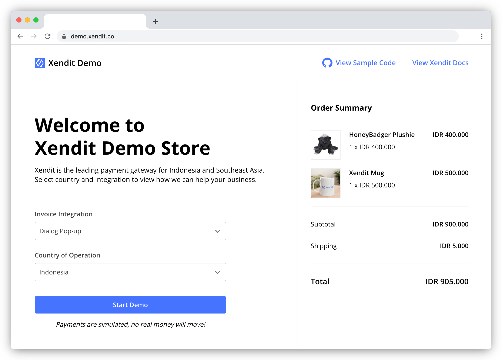
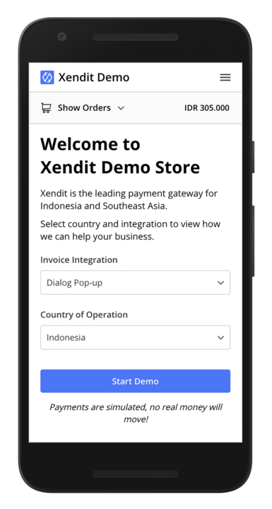

# Xendit Checkout Demo

This demo is a mock e-commerce store that illustrates creation (backend) and presentation (frontend) of a hosted Xendit Checkout page.
The backend uses a simple [ExpressJS](https://expressjs.com/) server to proxy the request from client-side to the [Xendit API Gateway](https://developers.xendit.co/api-reference/#invoices), while the frontend uses pure JavaScript & HTML. 

**You can see this demo app running in test mode at [demo.xendit.co](https://demo.xendit.co)**

## Overview

Our sample code demonstrates for Xendit Checkout:
- Integration via dialog pop-up (a.k.a. modal iframe) and redirect
- Creation of checkout pages for IDR and PHP
- Simple integration to create an invoice using Xendit API Gateway

Xendit Checkout is the fastest way to start collecting online payments in Indonesia and Philippines.

|     | Features
:---: | :---
💸 | **Over 30 different payment methods**. 19 payment methods accepting Indonesian Rupiah (IDR) and 14 payment methods accepting Philippine Pesos (PHP), with more on the way. For more information about our supported payment channels, visit [here](https://docs.xendit.co/xeninvoice/payment-channels).
📱 | **Beautiful, responsive UIs optimized for each payment method**. For example, we do barcode generation for Alfamart/Indomaret, and maintain 19 sets of up-to-date instructions for Virtual Accounts. We also formatting and front-end validation for phone numbers and credit card data.
🔐 | **PCI-DSS compliance and 3DS handling**. Making it easier to offer and handle credit cards.
🗺 | **Supports multi-language integration**. Full UI localization that has been tested across millions of successful transactions.
🚀 | **Ongoing maintenance and continuous improvement**. Whenever a payment partner makes a change, our team of developers quickly handles it, so you don't have to.

## Codebase Structure

The frontend sample code for the demo is in the `public/` directory.

The core logic of the Xendit Checkout is mostly contained within two files:

1.  [`server/routes.js`](server/routes.js) defines the routes on the backend that create Xendit invoice/checkout data.
2.  [`server/controller.js`](server/controller.js) defines the request that will be forwarded to the Xendit API Gateway.

There is also one file called [`server/config.js`](server/config.js) that stores the configurable pre-filled invoice data (`payer_email` and `description`). You can override those values in the [`server/routes.js`](server/routes.js).

## Getting Started

### Requirements

You’ll need the following:

- [Node.js](https://nodejs.org) >= `10.0.0`
- [NPM](https://npmjs.org) >= `6.0.0`
- Xendit account to accept payments ([sign up](https://dashboard.xendit.co/register/1) for free). After registering, please [generate](https://dashboard.xendit.co/settings/developers#api-keys) a secret key with **MONEY-IN WRITE** permissions. You'll need this to perform requests for creating invoices. 

After registering an account and generating a secret key, you can [enable the payment methods](https://dashboard.xendit.co/invoices) you’d like to test by clicking on **Customize** button in the invoice page (Home > Accept Payments > Invoices). By default, all enabled and available payment methods will be available for an invoice.

### Running the Node Server

You need to modify your environment variables as stated in [`.env.example`](.env.example) to your needs. In this case, you need to set these values: 

- `process.env.PORT`
- `process.env.API_GATEWAY_URL`
- `process.env.API_KEY`

The value of `API_GATEWAY_URL` should be **https://api.xendit.co**. For the `API_KEY`, please use the key you previously generated. As for the `PORT`, you can define it by using the available port on your local machine or it will be provided by default value which is `8000`.

Install dependencies using npm:

    npm install

After installation is done, start the local server along with the environment variables:

    PORT=<port> API_GATEWAY_URL=https://api.xendit.co API_KEY=<your-secret-key> npm run start

If everything went well, you should see the following message in your terminal:

    server is listening on port: <port>

Then you can point your browser to the `http://localhost:<port>`
